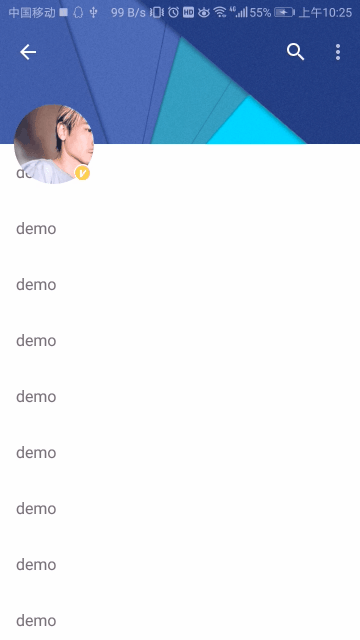

CollapsingToolbarLayout
===============

Imitate Sina Weibo International Edition Personal Center Page Slide Effect.
模仿新浪微博国际版个人中心页滑动效果

Use CollapsingToolbarLayout and CoordinatorLayout to achieve beautiful effects, mainly by listening to AppBarLayout's onOffsetChanged to achieve the effect.
使用CollapsingToolbarLayout和CoordinatorLayout实现绚丽效果，主要通过监听AppBarLayout的onOffsetChanged来实现效果。

官方效果
------

模仿效果
-----

License
-------

    Copyright 2018 CaoKai-Beyond

    Licensed under the Apache License, Version 2.0 (the "License");
    you may not use this file except in compliance with the License.
    You may obtain a copy of the License at

        http://www.apache.org/licenses/LICENSE-2.0

    Unless required by applicable law or agreed to in writing, software
    distributed under the License is distributed on an "AS IS" BASIS,
    WITHOUT WARRANTIES OR CONDITIONS OF ANY KIND, either express or implied.
    See the License for the specific language governing permissions and
    limitations under the License.
